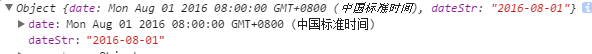

# ui-mcalendar
日历选择插件

## 兼容性说明
适用于移动端浏览器

## 安装

```sh
npm install git+http://gitlab.futunn.com/webpackage/ui-mcalendar.git#1.0.0
npm install ui-mcalendar
```

## 使用
支持页面直接引入、AMD、CommonJs的方式加载模块

#### 调用
1.引入样式文件，或者自定义样式;如果引用的js为`indexCss.js`则无需手动引入css文件 
```
<link rel="stylesheet" type="text/css" href="ui-mcalendar/src/ui-mcalendar.css"/>
```

2.引入js，以直接引入为例
```
<script type="text/javascript" src="ui-mcalendar/index.js"></script>
```
或者直接引入包含了css文件的js，则无需手动引入`ui-mcalendar.css`
```
<script type="text/javascript" src="ui-mcalendar/indexCss.js"></script>
```
3.实例化插件
HTML:
```
<!--选择日期后值保存在这里-->
<input tpye="input" id="calendarValue"/>
<!--日历容器-->
<div class="wrapper"></div>
```
JS:
```
var input = document.querySelector("#calendarValue");
var cal = new futuCalendar({
    wrapper:".wrapper",
    valueTarget:input,
    selectMonth:function(instance,info,offset){
        alert("你切换了月") 
    },
    selectDateCallback:function(el,dataInfo){
        console.log("你选择了日期");
    }
});
cal.show();
```

一个完整的配置如下：
```
 var cal = new futuCalendar({
    wrapper:".wrapper",
    templateStr:"<div>.....</div>",
    autohide:true,
    showToolBar:true,
    toolList:[{
        text:"关闭",
        className:"closeCalendar",
        action:function(instance,item){
            instance.hide();
            console.log(item);
        }
    }],
    valueTarget:input,
    templateStr:document.querySelector("#templatedemo").innerHTML,
    enableList:["2016-08-01","2016-08-02"],
    defaultDate:new Date("2016-08-01"),
    selectMonth:function(instance,info,offset){
        console.log(info);
    },
    selectDateCallback:function(el,dataInfo){
        console.log(dataInfo);
    }
});
```

#### 效果图


## 目录结构
 

`example`: 示例目录
`src`:index.js组件源码，commonjs模式，不可直接运行；ui-calendar.css 默认提供的样式
`template`：日历模板
`gulpfile`：打包配置
`index.js`：打包后的源码,不包含css，使用时可手动引入`ui-calendar.css`
`indexCss.js`：打包后的源码,包含css，使用时**无需**手动引入`ui-calendar.css`
`readme.md`：说明文档

## API
#### 1. `futuCalendar(config)`
构造函数，参数：

- `config`: 日历配置相关参数，json对象，具体字段见参数说明。
	- `config.templateStr`
	   类型：String。
	   默认值: 组件默认的模板字符串，模板文件存在于`templates/mcalendar.html`中；用户可以自定义组件模板类型，用于增减页面元素。

	- `config.wrapper`
	   类型：<Element|String>，页面元素或者是元素选择器。
       说明：组件容器，用于存放日历实例。
       默认值：空，需用户指定，可选。

    - `config.valueTarget`
	   类型：<Element|String>，页面元素或者是元素选择器。
       说明：选择某个日期时，会将日期赋值给该元素，如果该元素为input，textarea，则赋值给value属性。否则赋值给元素的innerHTML属性。
	   默认值： 空，可选。

	- `config.dataFormat`
	   类型：String
       说明：填充valueTarget元素的日期格式。各个占位符意思如下： `yyyy`：年份，四位, `MM`:月份，两位, `dd`:日期，2位
       默认值：`yyyy-MM-dd`, 例如：2016-10-01。

    - `config.weekdates`
       类型：Array,
       说明：由于显示星期的名称，插件默认每周首日从周日开始。
	   默认值：["日", "一", "二", "三", "四", "五", "六"]。
	   > 此处功能待扩展
	  
    - `config.autohide`
       类型：Boolean
       说明：选中某个日期之后，是否自动关闭（不显示）日历。
	   默认值：true,默认会自动关闭。
    
    - `config.enableList`
	   类型：<Array|"all">
	   说明：指明是否所有日期是否可选。当前值为字符创`all`时，表示所有 日期均可选，如果只为数组，则表示只有数组中的日期可被选中，此时，能被选中的日期将会获得 `selectable`类用于标识突出。   
       默认值：`all`，默认所有日期均可选择。

    - `config.defaultDate`
       类型：Date
       说明：初次显示日历时，被选中的日期，如果不设置则关联的`valueTarget`不设置值
	   默认值：空。

	- `config.initshow`
	   类型：Boolean
       说明：初始化时，是否立即显示日历。
	   默认值：false，默认不显示日历。

	- `config.initshow`
	   类型：Boolean
       说明：是否显示mask。
	   默认值：false，默认不显示遮罩。

    - `config.toolList`
       类型：Array
	   说明：用于生成顶部工具栏的数组列表
	   结构说明：每个节点最终会生成一个a节点，插入`tool-bar`中.
       - `toolList[i].text`:节点（工具按钮）名
       - `toolList[i].className`:用户设定的类名，可用于自定义样式
	   - `toolList[i].action`:点击工具按钮时的回调函数，回参包括日历实例instance，及当前点击元素item；instance对象可调用其方法，详见下方方法说明。
	   DEMO：
       ```
	   toolList:[
			{
                text:"关闭",
                className:"closeCalendar",
                action:function(instance,item){
                    instance.hide();
                    console.log(item);
                }
            }
	   ]
       ```
	   默认值：空

    - `config.showToolBar`
       类型:Boolean
	   说明:是否显示工具栏，为true时显示，为false则不显示。
	   默认值：false,不显示工具栏
    - `config.selectDateCallback(el, dateInfo)`
       类型：Function
	   说明：选中某个日期时的回调，注意：只有当前日期可被选中时才会执行。回参包括被选中的DOM元素，dateInfo为json对象，结构如下`{date:日期对象，dateStr：符合config.dataFormat格式的日期字符串}`。
	   默认值:空。

    - `config.selectMonth(instance, monthAndYear, offset)`
       类型：Function
	   说明：切换月份时的回调函数，注意在初始化日历时也会被调用。回参包括日历实例instance，instance对象可调用其方法，详见下方方法说明。monthAndYear为json对象，包含年份及月份信息，结构为：`{month:月份，year：年份}`。offset为月份变动值，为1表示向往后推进一个月，-1表示向以前推进一个月，0表示初始化。
	   默认值:空。

#### 2. `futuCalendar#show(callback)`
说明：全局方法，显示日历,实例化日历时默认不显示，可调用此方法来显示，
参数：显示日历时的回调函数，回调函数的参数为日历实例，
return：`this`，当前日历实例，
demo:
```
cal.show(function(instance){
    console.log("这是日历对象",instance);
});
```
#### 3. `futuCalendar#hide(callback)`
说明：全局方法，隐藏日历，
参数：显示日历时的回调函数，回调函数的参数为日历实例，
return：`this`，当前日历实例，
demo:
```
cal.hide(function(instance){
    console.log("这是日历对象",instance);
});
```
#### 4. `futuCalendar#getDateInfo()`
说明：全局方法，获取当前选择的日期
return：JSON对象，日期信息，格式为`{date:Date对象，dateStr：符合option.dataFormat格式的时间字符串}`；
demo:
```
var info = cal.getDateInfo();
console.log(info);

```


#### 5. `futuCalendar#goLastMonth(callback)`
说明：切换到上一个月的日历信息
参数：切换后的回调函数，回调函数的参数为日历实例，
return：`this`，当前日历实例，
demo:
```
cal.goLastMonth(function(instance){
    console.log("你切换到了上个月，这是日历对象",instance);
});
```

#### 6. `futuCalendar#goNextMonth(callback)`
说明：切换到下一个月的日历信息
参数：切换后的回调函数，回调函数的参数为日历实例，
return：`this`，当前日历实例，
demo:
```
cal.goLastMonth(function(instance){
    console.log("你切换到了下个月，这是日历对象",instance);
});
```

#### 7. `futuCalendar#setDate(date, callback)`
说明：设置日历的日期，即设置那一天被选中
参数：`date`为Date对象或者可以被实例化为Date对象的变量，`callback`为切换后的回调函数，回调函数的参数为日历实例，
return：`this`，当前日历实例，
demo：
```
cal.setDate(date，function(instance){
    console.log("你切换到日期，这是日历对象",instance);
});
```

#### 8. `futuCalendar#setCliableList(list,callback)`
说明：重新设置可以点击的日期，会覆盖enableList中的配置
参数：`list`为日期数组，如`["2016-12-01","2016-12-02"]`或者`[new Date("2016-12-01")]`,数组中元素需要可以实例化为Date对象;callback为回调函数，函数参数为数组中日期所对应的日期DOM元素。
demo：
```
// 设置"2016-09-22","2016-09-23"可点击，并将对应dom字体颜色设置为red；
cal.setCliableList(["2016-09-22","2016-09-23"],function(item){
    item.style.color = "red";
});
```

#### 9. `futuCalendar#getItemIndexByDate(date)`
说明：根据日期获取指定元素的索引
参数：`date`为Date对象或者可以被实例化为Date对象的变量。
return：Number,返回该日期在42个日期元素中的索引。

#### 10. `futuCalendar#getItem(date)`
说明：根据日期或者索引获取指定元素
参数：当date为日期时，如果当前日期未在当前日历上显示，则返回空；当date为数值时，则返回42个日期元素中的指定dom元素。
return：Element,对应的日期DOM元素

## 开发
1. 源码位于src/index.js，开发完成后在ui-mcalendar目录下运营`gulp`命令，生成根目录下的index.js。
2. 实例项目examples中，使用script标签的方式引入，可直接运行。
3. 依赖`underscore.js`,开发过程中已进行打包，无需重复引入

## 版本记录

### 1.0.7 2016-09-23
- 解决gulpfile错误

### 1.0.6 2016-09-23
- 使用click代理tap事件，解决点击击穿问题

### 1.0.5 2016-09-23
- 修正readme文件

### 1.0.4 2016-09-23
- 提供了打包了css的版本

### 1.0.3 2016-09-23
- 修复bug，增加配置参数

### 1.0.2 2016-09-22
- 修复bug，增加配置参数

### 1.0.0 2016-09-22
- 初始化版本，完成代码及文档
