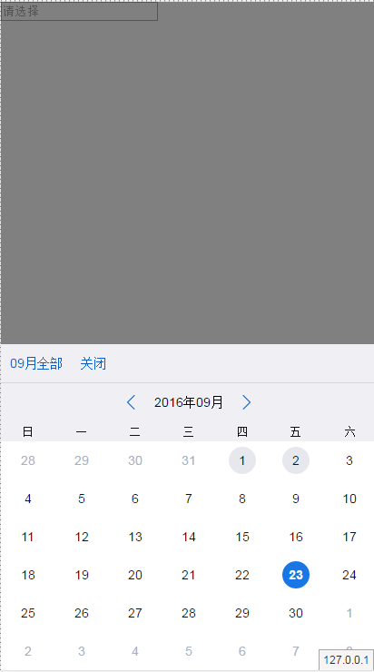
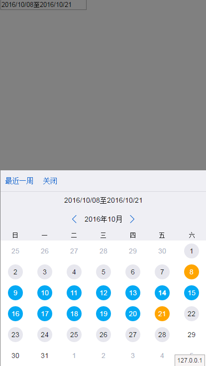
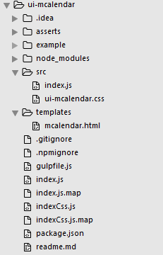
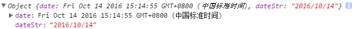
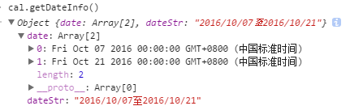
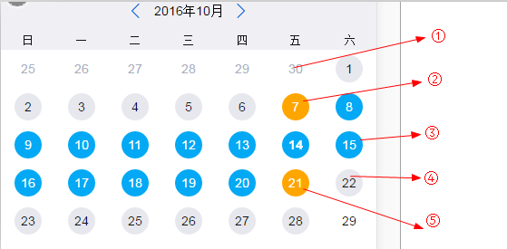
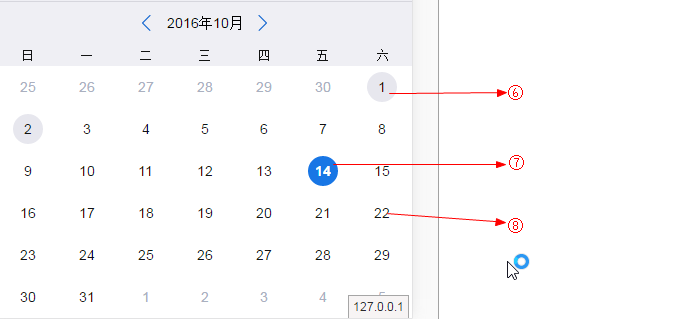

# ui-mcalendar
日历选择插件

## 兼容性说明
适用于移动端浏览器

## 特性

1. 选择单个时间点
2. 选择起始时间段
3. 选择单个时间点时可指定能被选择的枚举日期
4. 选择起始时间段时，指定能被选择的起始范围
5. 支持自定义日历模板
6. 支持自定义工具栏
7. 支持与具体的input等元素绑定

## 安装

```sh
 npm install ui-mcalendar
```

## 使用
支持页面直接引入、AMD、CommonJs的方式加载模块

#### 调用
1.引入样式文件，或者自定义样式;如果引用的js为`indexCss.js`则无需手动引入css文件 
```
<link rel="stylesheet" type="text/css" href="ui-mcalendar/src/ui-mcalendar.css"/>
```

2.引入js，以直接引入为例
```
<script type="text/javascript" src="ui-mcalendar/index.js"></script>
```
或者直接引入包含了css文件的js，则无需手动引入`ui-mcalendar.css`
```
<script type="text/javascript" src="ui-mcalendar/indexCss.js"></script>
```
3.实例化插件
HTML:
```
<!--选择日期后值保存在这里-->
<input tpye="input" id="calendarValue"/>
<!--日历容器-->
<div class="wrapper"></div>
```
JS:
```
var input = document.querySelector("#calendarValue");
var cal = new futuCalendar({
    wrapper:".wrapper",
    valueTarget:input,
    selectMonth:function(instance,info,offset){
        alert("你切换了月") 
    },
    selectDateCallback:function(el,dataInfo){
        console.log("你选择了日期");
    }
});
cal.show();
```

一个完整的配置如下：
```
// 选择单个日期
 var cal = new futuCalendar({
    wrapper:".wrapper",
    templateStr:"<div>.....</div>",
    autohide:true,
    showToolBar:true,
    toolList:[{
        text:"关闭",
        className:"closeCalendar",
        action:function(instance,item){
            instance.hide();
            console.log(item);
        }
    }],
    valueTarget:input,
    templateStr:document.querySelector("#templatedemo").innerHTML,
    enableList:["2016-08-01","2016-08-02"],
    defaultDate:new Date("2016-08-01"),
    selectMonth:function(instance,info,offset){
        console.log(info);
    },
    selectDateCallback:function(el,dataInfo){
        console.log(dataInfo);
    }
});

//选择起始时间段
var cal = new futuCalendar({
      wrapper:".wrapper",
      initshow: false,
      autohide:false,
      hasMask:true,
      startEndSelect: true,
      startEndDataFormat:"yyyy/MM/dd至yyyy/MM/dd",
      startEndConfig:{
          allowStartDate:new Date("2016-09-01"),
          allEndDate:new Date("2016-12-01"),
          duration:60,
          itemClass:"startenditem",
          exceedDuration:function(duration){
              alert("日期选择超过了起始差"+duration);
          }
      },
      showToolBar:true,
      toolList:[{
          text:"最近一周",
          className:"nearweak",
          action:function(instance,item){
              instance.setSEPoints(d,+d + 6*24*3600*1000,function(){});
          }
      },{
          text:"关闭",
          className:"closeCalendar",
          action:function(instance,item){
              instance.hide();
          }
      }],
      valueTarget:input,
      selectDateCallback:function(el,dataInfo){
          console.log(dataInfo);
      }
  });
```


[更多实例](example/)

#### 效果图

 


## 目录结构
 

`example`： 示例目录

`src`：index.js组件源码，commonjs模式，不可直接运行；ui-calendar.css 默认提供的样式

`template`：日历模板

`gulpfile`：打包配置

`index.js`：打包后的源码,不包含css，使用时可手动引入`ui-calendar.css`

`indexCss.js`：打包后的源码,包含css，使用时**无需**手动引入`ui-calendar.css`

`readme.md`：说明文档


**在ui-mcalendar目录下运行 `$ npm start`命令，即可在浏览器中看到目录机构**

## API
#### 1. `futuCalendar(config)`
构造函数，参数：

- `config`: 日历配置相关参数，json对象，具体字段见参数说明。
	- `config.templateStr`

	   **类型：** `String`。

	   **默认值:** 组件默认的模板字符串，模板文件存在于`templates/mcalendar.html`中；用户可以自定义组件模板类型，用于增减页面元素。

	- `config.wrapper`
	   
       **类型：** `<Element|String>`，页面元素或者是元素选择器。
       
       **说明：** 组件容器，用于存放日历实例。
       
       **默认值：** 空，需用户指定，可选。

    - `config.valueTarget`
	   
       **类型：** `<Element|String>`，页面元素或者是元素选择器。
       
       **说明：** 选择某个日期时，会将日期赋值给该元素，如果该元素为input，textarea，则赋值给value属性。否则赋值给元素的innerHTML属性。
	   
       **默认值：** 空，可选。

	- `config.dataFormat`
	   
       **类型：** String
       
       **说明：** 填充valueTarget元素的日期格式。各个占位符意思如下： `yyyy`：年份，四位, `MM`:月份，两位, `dd`:日期，2位
       
       **默认值：** `yyyy-MM-dd`, 例如：2016-10-01。

    - `config.weekdates`
       
       **类型：** Array,
       
       **说明：** 由于显示星期的名称，插件默认每周首日从周日开始。
	   
       **默认值：** ["日", "一", "二", "三", "四", "五", "六"]。
	   > 此处功能待扩展
	  
    - `config.autohide`
       
       **类型：** Boolean
       
       **说明：** 选中某个日期之后，是否自动关闭（不显示）日历。
	   
       **默认值：** true,默认会自动关闭。
    
    - `config.enableList`
	   
       **类型：** <Array|"all">
	   
       **说明：** 指明是否所有日期是否可选。当前值为字符创`all`时，表示所有 日期均可选，如果只为数组，则表示只有数组中的日期可被选中，此时，能被选中的日期将会获得 `selectable`类用于标识突出。   
       
       **默认值：** `all`，默认所有日期均可选择。

    - `config.defaultDate`
       
       **类型：** Date
       
       **说明：** 初次显示日历时，被选中的日期，如果不设置则关联的`valueTarget`不设置值
	   
       **默认值：** 空。

	- `config.initshow`
	   
       **类型：** Boolean
       
       **说明：** 初始化时，是否立即显示日历。
	   
       **默认值：** false，默认不显示日历。

	- `config.hasMask`
	   
       **类型：** Boolean
       
       **说明：** 是否显示mask。
	   
       **默认值：** false，默认不显示遮罩。

    - `config.toolTemplateStr`

      **类型：** String 或者 Function

      **说明：** 可选，用于自定义工具栏部分的模板。如果不设置，则所有按钮均使用`a`标签,class属性及文本内容。用户可通过此参数配置每个按钮更多属性。当此参数为Function时，必须返回一个字符串作为模板。示例如下：

      ```
          <script type="text/template" id="demo-tooltemplate">
              <%_.each(toolList,function(item,i){%>
                 <a href='javascript:void(0)' name='test' age='27' tool-id='<%=i%>'  class='<%=item.className%>  tool-item'>按钮<%=item.text%></a>
              <%})%>
          </script>
      ```

      **默认值：** 空

    - `config.toolList`
       
       **类型：** Array
	   
       **说明：** 用于生成顶部工具栏的数组列表
	   
       **结构说明：** 每个节点最终会生成一个a节点，插入`tool-bar`中.
       - `toolList[i].text`:节点（工具按钮）名
       - `toolList[i].className`:用户设定的类名，可用于自定义样式
	   - `toolList[i].action`:点击工具按钮时的回调函数，回参包括日历实例instance，及当前点击元素item；instance对象可调用其方法，详见下方方法说明。
	   DEMO：

       ```
       toolList:[{
            text:"关闭",
            className:"closeCalendar",
            action:function(instance,item){
                instance.hide();
                console.log(item);
            }
        }]
       ```

	   **默认值：** 空

    - `config.showToolBar`
       
       **类型：** Boolean
	   
       **说明：** 是否显示工具栏，为true时显示，为false则不显示。
	   
       **默认值：** false,不显示工具栏

    - `config.startEndSelect`
       
       **类型：** Boolean
     
       **说明：** 日历是否能选择起始时间段（2个时间值），为true及可选择起始时间点，为false只能选择一个日期。
     
       **默认值：** false, 只能选择一个时间点

    - `config.startEndDataFormat`
       
       **类型：** String
     
       **说明：**日历选择的起始时间段（2个时间值），最终会展示的时间格式，主要涉及`onfig.valueTarget`元素内容及`getDateInfo().dateStr`的内容格式,只有在`config.startEndSelect`为true时有意义。
       
       **默认值：** yyyy/MM/dd-yyyy/MM/dd
	
    - `config.startEndConfig`
       
       **类型：** JSON
	   
       **说明：** 日历允许选择的起始时间段时的配置JSON
		   
	       - `startEndConfig.allowStartDate`: 选择时间段时，能选择的最小日期, 类型为Date。
	       - `startEndConfig.allEndDate`: 选择时间段时，能选择的最大日期， 类型为Date。
		   - `startEndConfig.duration`: 选择的时间段包含的日期个数最大值；用户选择的2个时间区间大于该值时会触发exceedDuration函数， 类型为Number。
		   - `startEndConfig.defaultStartEnd`:  默认选择的起始时间点，`[start,end]`,类型为数组，长度为2，元素为可实例化为Date，对象的变量;`start`和`end`必须在`startEndConfig.allEndDate`和`startEndConfig.allEndDate`间，且时间间隔小于或者等于`startEndConfig.duration`，否则视为无效设置。
	   	   - `startEndConfig.itemClass`: 选择的时间区间中的日期的className,用户可设置为其他值以改变样式，默认为"startenditem"。
	   	   - `startEndConfig.exceedDuration(num,item)`: 用户选择的2个时间区间大于该值时会触发此函数，选择的区间不会生效，回调函数包含2个参数。item表示用户第二次选择的日期元素，num表示用户选择的区间所包含的日期个数。
	   	   
	   **默认配置**

	   ```
		{
            duration: 10000000,
            itemClass: "startenditem"
        }
	   ```
	   **demo**

	   ```
	   var d = new Date();
	   // ......
	   startEndConfig:{
            allowStartDate:new Date("2016-"+(d.getMonth()+1)+"-01"),
            allEndDate:new Date("2016-"+(d.getMonth()+1)+"-28"),
            duration:20,
            itemClass:"startenditem",
            exceedDuration:function(duration,item){
                alert("你选择的日期个数超标，共"+duration+"个日期");
            }
        }
	   ```

    - `config.selectDateCallback(el, dateInfo)`
       
       **类型：** Function
	   
       **说明：** 选中某个日期时的回调，注意：只有当前日期可被选中时才会执行。回参包括被选中的DOM元素，dateInfo为json对象，结构如下`{date:日期对象，dateStr：符合config.dataFormat格式的日期字符串}`。
	   
       **默认值:** 空。

    - `config.selectMonth(instance, monthAndYear, offset)`
       
       **类型：** Function
	   
       **说明：** 切换月份时的回调函数，注意在初始化日历时也会被调用。回参包括日历实例instance，instance对象可调用其方法，详见下方方法说明。monthAndYear为json对象，包含年份及月份信息，结构为：`{month:月份，year：年份}`。offset为月份变动值，为1表示向往后推进一个月，-1表示向以前推进一个月，0表示初始化。
	   
       **默认值：** 空。

    - `config.displayChange(showOrhide)`
       
       **类型：** Function
     
       **说明：** 用户关闭或者显示日历时始终会执行的函数，如果设置了show或者hide方法的回调，则此方法会在回调方法之后再执行；`showOrhide`表示刚刚执行的动作，`true`即表示执行了显示日历操作，`false`表示执行了关闭日历的操作。
     
       **默认值：** 空。

    - `config.unSelectable(target)`
       
       **类型：** Function
     
       **说明：** 点击了不可选的日期时的回调函数，主要用于指定了点击区域或者某些日期情况下的提示， `target`为用户点击的日期。

       **return：** 此函数需要设置返回值，当unSelectable返回true时，点击日期后日历会根据`config.autohide`来进行显示或者隐藏；返回为false时，点击日期后日历保持原状，即不会隐藏。如不设置返回值，默认返回false。
     
       **默认值：** 空。

#### 2. `futuCalendar#show(callback)`

**说明：** 全局方法，显示日历,实例化日历时默认不显示，可调用此方法来显示，

**参数：** 显示日历时的回调函数，回调函数的参数为日历实例，

**return：** `this`，当前日历实例，

**demo:**
```
cal.show(function(instance){
    console.log("这是日历对象",instance);
});
```
#### 3. `futuCalendar#hide(callback)`

**说明：** 全局方法，隐藏日历，

**参数：** 显示日历时的回调函数，回调函数的参数为日历实例，

**return：** `this`，当前日历实例，

**demo:**
```
cal.hide(function(instance){
    console.log("这是日历对象",instance);
});
```
#### 4. `futuCalendar#getDateInfo()`

**说明：** 全局方法，获取当前选择的日期

**return：** JSON对象，日期信息，分两种情况
- 当`config.startEndSelect`为false（默认为false）时，返回的值为选中的单个日期信息。格式为`{date:Date对象，dateStr：符合option.dataFormat格式的时间字符串}`；
如：

 
- 当`config.startEndSelect`为true（即用户选择的为时间段）时，返回的是时间段信息。格式为`{date:[开始时间对象,结束时间对象],ateStr：符合option.startEndDataFormat格式的时间字符串}`
如：

 

#### 5. `futuCalendar#goLastMonth(callback)`

**说明：** 切换到上一个月的日历信息

**参数：** 切换后的回调函数，回调函数的参数为日历实例，

**return：** `this`，当前日历实例，

**demo:**
```
cal.goLastMonth(function(instance){
    console.log("你切换到了上个月，这是日历对象",instance);
});
```

#### 6. `futuCalendar#goNextMonth(callback)`

**说明：** 切换到下一个月的日历信息

**参数：** 切换后的回调函数，回调函数的参数为日历实例，

**return：**`this`，当前日历实例，

**demo:**
```
cal.goLastMonth(function(instance){
    console.log("你切换到了下个月，这是日历对象",instance);
});
```

#### 7. `futuCalendar#setDate(date, callback)`

**说明：** 设置日历的日期，即设置那一天被选中

**参数：** `date`为Date对象或者可以被实例化为Date对象的变量，`callback`为切换后的回调函数，回调函数的参数为日历实例，

**return：** `this`，当前日历实例，

**demo：**
```
cal.setDate(date，function(instance){
    console.log("你切换到日期，这是日历对象",instance);
});
```

#### 8. `futuCalendar#setCliableList(list,callback,showRightNow)`

**说明：** 重新设置可以点击的日期，会覆盖enableList中的配置

**参数：** `list`为日期数组，如`["2016-12-01","2016-12-02"]`或者`[new Date("2016-12-01")]`,数组中元素需要可以实例化为Date对象;callback为回调函数，函数参数为数组中日期所对应的日期DOM元素；showRightNow表示设置完成之后是否理解显示日历，默认不显示；showRightNow为true时则设置完成之后立即显示日历。

**demo：**
```
// 设置"2016-09-22","2016-09-23"可点击，并将对应dom字体颜色设置为red,并且立即显示；
cal.setCliableList(["2016-09-22","2016-09-23"],function(item){
    item.style.color = "red";
},true);
```

#### 9. `futuCalendar#getItemIndexByDate(date)`

**说明：** 根据日期获取指定元素的索引

**参数：** `date`为Date对象或者可以被实例化为Date对象的变量。

**return：** Number,返回该日期在42个日期元素中的索引。

#### 10. `futuCalendar#getItem(date)`

**说明：** 根据日期或者索引获取指定元素

**参数：** 当date为日期时，如果当前日期未在当前日历上显示，则返回空；当date为数值时，则返回42个日期元素中的指定dom元素。
**return：** Element,对应的日期DOM元素

#### 11. `futuCalendar#setSEPoints(startDate,endDate,callback,showEndMonth)`

**说明：**在开启选取起始点功能时，设置指定起始点间的日期被选中,注意，此时会限制于`config.startencconfig`中的设置,否则会抛出异常

**参数：** `startDate`为时间段的起始日期，`endDate`为结束日期，`startDate`和`endDate`为Date实例或者可以实例化为Date对象的变量（时间戳或者日期字符串），`callback`为设置之后的回调函数，回调函数参数为当前日历实例。`showEndMonth`:设置起始日期之后，是否显示当前日历为结束月的日历；`true`时显示设置的结束日期所在月的日历，`false`时显示开始时间所在月的日历。

**return：** this，当前日历实例，

**demo：**
```
var d = new Date();
instance.setSEPoints(d,+d + 6*24*3600*1000,function(instance){
	alert("耶，您成功选择了最近一周的日期");
});

```

## 日历日期元素样式重写指引
1. 组件提供的默认样式保存在/src/ui-mlcalendar.css中，用户亦可以自己进行覆盖重写相关样式。

2. 不同状态的日期元素说明
	
	
	
	
	① :日期属于上月或者下月时的样式，样式选择器为：`.futu-calendar .regular-date li.othermonth span`
	
	②，⑤：选择时间段时标志起始时间点的样式，选择器为：`.futu-calendar .regular-date li.startendflag span`
	
	③: 时间段内日期的样式，用户可以通过'config.startEndconfig.itemClass'指定该元素的class, 以便更方便重写样式,默认的样式选择器为：	`.futu-calendar .regular-date li.startenditem span`
	
	④，⑥：在只有一部分日期能选择时，用于标志可以被点击的日期的样式，选择器为：`.futu-calendar .regular-date li.selectable span`
	
	⑦：单选日期时，被选中的日期的样式，样式选择器为：`.futu-calendar .regular-date li.selected span`
	
	⑧： 普通日期，样式选择器为：`.futu-calendar .regular-date ul li span`

demo:
```
.futu-calendar .regular-date ul li span{
    font-size: 100%;
    background-color:white;
}
/* 可选日期 */
.futu-calendar .regular-date li.selectable span{
    background-color: green;
    color: white;
}
/* 被选中的日期 */
.futu-calendar .regular-date li.selected span{
    background-color: pink;
    color: white;
}
/* 其他月份 */
.futu-calendar .regular-date li.othermonth span{
    background-color: gray;
    color: white;
}
/*起始日期间的日期*/
.futu-calendar .regular-date li.startenditem span{
    background-color: red;
    color: white;
}
/* 起始日期 */
.futu-calendar .regular-date li.startendflag span{
    background-color: orange;
    color: white;
}
```

> 更多样式情况请直接通过元素定位工具进行查找即可。

## 开发
1. 源码位于src/index.js，开发完成后在ui-mcalendar目录下运营`gulp`命令，生成根目录下的index.js。
2. 实例项目examples中，使用script标签的方式引入，可直接运行。
3. 依赖`underscore.js`,开发过程中已进行打包，无需重复引入。
4. 在ui-mcalendar目录下运行 `$ npm start`命令即开启一个`http-server`。

## 版本记录

### 1.2.0 2016-12-23
-  代码健壮，不直接使用通过配置传入的日期对象，而是重新实例化
-  增加组件的异常提示

### 1.1.9 2016-11-14
-  增加参数用于设置时间段时，显示的是开始月还是结算月

### 1.1.8 2016-11-11
-  增加参数用于设置时间段时，显示的是开始月还是结算月


### 1.1.7 2016-11-10
- 修复重复选择时间段时日期不被选中的问题

### 1.1.6 2016-11-02
- 增加参数用于自定义工具栏模板
- 其他细节改进 

### 1.1.5 2016-10-27
- 选择时间段时，增加参数`startEndConfig.defaultStartEnd`,用于设置默认选则的时间段
- 修复在没有设置`startEndConfig.allowStartDate`,`startEndConfig.allEndDate`时选择时间段不成功的问题
- 解决IOS闪烁效果
- 解决IOS上日期排序不准确的问题

### 1.1.3 2016-10-24
- 修正readme样式
- 增加点击了不可选日期时的回调

### 1.1.2 2016-10-20
- 增加displayChange配置方法，当用户显示或者关闭日历时始终会执行的方法

### 1.1.1 2016-10-19
- 优化样式，防止被外部样式覆盖

### 1.1.0 2016-10-14
- 新增选择时间段功能
- 其他代码优化

### 1.0.10 2016-09-30
- 解决document.children属性不兼容的问题，使用childNode兼容

### 1.0.9 2016-09-27
- 处理forEach不兼容的问题，使用underscore的each方法代替
- 扩展`setCliableList`参数以便于用户设置日历是否立即可见

### 1.0.8 2016-09-26
- 使用click代理tap事件，解决点击击穿问题

### 1.0.7 2016-09-23
- 解决gulpfile错误

### 1.0.6 2016-09-23
- 使用click代理tap事件，解决点击击穿问题

### 1.0.5 2016-09-23
- 修正readme文件

### 1.0.4 2016-09-23
- 提供了打包了css的版本

### 1.0.3 2016-09-23
- 修复bug，增加配置参数

### 1.0.2 2016-09-22
- 修复bug，增加配置参数

### 1.0.0 2016-09-22
- 初始化版本，完成代码及文档
